  

  ### Yeison Fajardo

  
  

Backend developer, studying Software Development at Universidad Provincial de Ezeiza, Buenos Aires.

I like the part of software you only notice when it breaks. Lately most of what I build sits between an AI model and something real: an MCP server that writes into Garmin Connect, a RAG API that runs entirely on my machine. I'd rather run models locally than send data somewhere I can't see.

<picture>
  <source media="(prefers-color-scheme: dark)" srcset="assets/access-log-dark.svg">
  
</picture>

My latest real commits, rewritten as server logs every day by <a href="scripts/access-log.mjs">a small script</a>. <code>feat</code> is a <code>POST 201</code>, <code>fix</code> is a <code>PATCH</code>, <code>chore</code> is a <code>204</code> nobody reads.

**Worth a look**

- [**garmin-coach-mcp**](https://github.com/Yeisonfjrd/garmin-coach-mcp): most Garmin integrations only read. This one writes structured workouts and schedules them, through endpoints Garmin doesn't document. Half the work was finding out what they actually return.
- [**docsearch-api**](https://github.com/Yeisonfjrd/docsearch-api): upload documents, ask questions, get answers that cite the exact page. Fastify, pgvector and Ollama, no external API involved.
- [**Short-url-backend**](https://github.com/Yeisonfjrd/Short-url-backend): a URL shortener in Go. Small on purpose.

**Usually working with** Java and Spring Boot · TypeScript, Node and Fastify · Go · PostgreSQL · Docker
